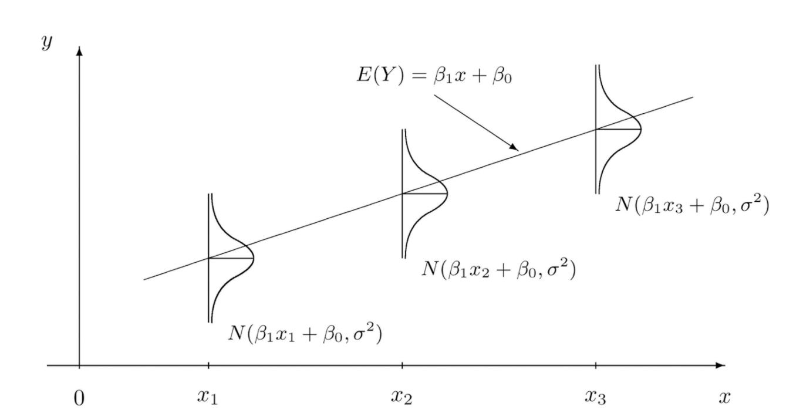

Here are the notes for general linear regression. 

# General Linear Model 1——Linear Regression

## 1.What is Linear Regression?

1) It is one of the most well known/understand algorithm in statistics and machine learning

2) Linear regression is a **linear model​**, which a linear relationship between the input $X$ and output $Y$. More technical, we can consider $Y$ can be a **linear combination** of $X$

Quote:  我们的目的就是找到一条直线，使所有我们之前input的点到这条直线的距离最小。

3) The representation of simpliest linear regression can be written as 
$$
Y= \beta_0+\beta_1X+\epsilon
$$
4) In statistics, this belongs to the parametric model, i.e. it has the parameter $\beta_0$ and $\beta_1$

(这里当然最好是$Y= \beta_0+\beta_1X$,，但是没办法我们有$\epsilon$,（但是我们知道它是normal）)

so, what is our target? 

为了找$Y$ 和$X$的关系——Find the best ${\beta}_0$ and ${\beta}_1$——find total error 最小（loss function）——find Least square

## 2. The keys

### 2.1 How to determine this model?(估计参数)

#### 2.1.1 Loss funtion？（we can link the more general case for the loss function）

​	1. 如何我们要知道我们好不好呢？就需要看看error

​		$Error=\left| y_i-y_i^{'}\right|$

2. error 可以变化吗？可以,　但是为了好计算所以用squre
3. loss function=total error

#### 2.1.2.最小二乘法

$$
Loss=\sum_{i=1}^{n} error^2=\sum_{i=1}^{n}(y_i-\beta_0+\beta_1X_i)^2
$$

1. 这里不一定要平方，但是平方和可以找到某种意义上的最好值

   2. 总的误差的平方最小的y就是真值，这个假设在误差是在随机波动下是最优的

   3. 

         1. 所以我们可以来找 
            $$
            Loss =\min_{\beta_0,\beta_1} \sum_{i=1}^{n}(y_i-\beta_0+\beta_1X_i)^2
            $$
            
2. 因着是找 $\beta_0$ and $\beta_1$
            $$
            \arg \min_{\beta_0,\beta_1} \sum_{i=1}^{n}(y_i-\beta_0+\beta_1X_i)^2
            $$
         
3. 所以我是在找$ \beta_0,\beta_1$使得$\sum_{i=1}^{n}(y_i-\beta_0+\beta_1X_i)^2$最小，也就是loss的最小
      
4. 最小二乘法不永远是最优

**一些提醒：**

1. least square（最小二乘法）是从cost function的角度，利用**距离**的定义建立目标函数；(注意最小二乘法是方法整个loss体系的建立可以link到statsitcal learning theory)

2. 经典的参数估计方法是从**概率的角度**建立目标，比如说最大似然估计MLE（maximum likelihood estimation）

#### 2.1.3 最大似然估计MLE（maximum likelihood estimation）

1. mle是什么？mle is a method of estimating the parameters of a statistical model given obersvation, by finding the parameter values  that maximize the likelihood of making the observation given the parameters.
   用参数估计的方法，在有了一定的观测值之后，来找parameter，让我们可以最有可能看到我们观测值，让我们可以最大程度放大我们的观测值

2.  如果对于linear regression 来说，相当与用一个方法，**去找穿过最大可能性（最大密度）(尽可能多的概率)的那些点的线上**
   1. 同时这条线对于x来说是最大可能性分布所在的线（CLT）
   2. 见图

3. 别忘了我们要使用model里的assumption： p(y|x) 是 $mean=\mu=f(x)$(和$x$有关), $variance=\sigma^2$（和$x$无关）的normal distribution（or we consider $\varepsilon \sim N(0,\sigma^2)$）

4. 推导**(面试必考题)**

   1. we know that $Y\bigm|X \sim N(\bar{\beta}_0+\bar{\beta}_1X, \sigma^2)$

   2.  
      $$
      p(Y_i\bigm|X_i)=\frac{1}{\sigma(2\pi)}e^{-\frac{1}{2\sigma^2}(Y_i-\bar{\beta}_0-\bar{\beta}_1X_i)^2}
      $$
      
3. $$
      L(\bar{\beta}_0,\bar{\beta}_1,\sigma^2)=p(Y_1,\cdots,Y_n\bigm|X_1,\cdots,X_n)=\frac{1}{\sigma^{n}(2\pi)^{n/2}}e^{-\frac{1}{2\sigma^2}\sum_{i=1}^n(Y_i-\bar{\beta}_0-\bar{\beta}_1X_i)^2}
      $$
   
   under the assumption $(X_1,Y_1),\cdots, (X_n,Y_n)$ are independent
   
   where $L(\bar{\beta}_0,\bar{\beta}_1,\sigma^2)=p(Y_1,\cdots,Y_n\bigm|X_1,\cdots,X_n)=p(Y_1\bigm|X_1,\cdots,X_n)\cdots p(Y_n\bigm|X_1,\cdots,X_n) =p(Y_1\bigm|X_1)p(Y_2\bigm|X_2)\cdots p(Y_n\bigm|X_n)$
   
4. the corresponding the log function:(我只关心parameter，log函数不影响单调等数学性质)
      $$
      \log L(\bar{\beta}_0,\bar{\beta}_1,\sigma^2)=-n\log(\sqrt{2\pi}\sigma)-\frac{1}{2\sigma^2}\sum_{i=1}^n(Y_i-\bar{\beta}_0-\bar{\beta}_1X_i)^2
      $$
      
   5. 所以我们要找的就是
   $$
      \arg \max -\sum_{i=1}^n(Y_i-\bar{\beta}_0-\bar{\beta}_1X_i)^2
      $$
      i.e. 
      $$
      \arg \min \sum_{i=1}^n(Y_i-\bar{\beta}_0-\bar{\beta}_1X_i)^2
      $$
      

##### 两者关系？

1. 当他们在linear regression下的assumption下，这两个方法得到结果是相通的
2. one is from statistics, and the other one is from optimization

##### 一点提醒：

1. noise是数据造成的，是inherent bias. error是模型造成的，是人为的。是两个不同的概念

#### 2.2 How is the performance of this model?（这个是来看模型自己的好坏，评价自己的参数）

我们只能系统的保证其不会偏差（$E(Y)=\mu$)

Consider 这个问题，我们需要link到统计上的假设检验问题

 null hypothesis : $\beta_1=0$

1. 目的是从统计上来判断这组数据和population相差多少，assessing the accuracy of the coefficient estimation,可以使用 $p$-value 或者是 confidence interval $\hat{\beta}_1 \pm 2SE(\hat{\beta}_1)$
2. 选择的统计量 $t=\frac{\hat{\beta}_1-0}{SE(\hat{\beta}_1)}$ 
   $t$ distribution with $n-2$ degrees of freedom assuming $\beta_1=0$

#### 2.3 How can we compare this model with others model?

(这个相当于模型外的判断模型的好坏 i.e. the extent to which the model fits the data)

1. assessing the overall accuracy
2. $RSE=\sqrt{\frac{1}{n-2}RSS}=\sqrt{\frac{1}{n-2}\sum_i^{n}(y_i-\hat{y}_i)^2}$

3.  $R^2=\frac{TSS-RRR}{TSS}=1-\frac{RSS}{\sum_i^{n}(y_i-\hat{y}_i)^2}$, 
   1. where  $TSS$ is total sum of squares, $RSS$ is the residual sum of squares(对误差的多少)
   2. 当是simple regression时，他相同于correlation
   3.  这里相当于 proportion of variability in $Y$ that can be explained using $X$ ($Y$ 的变化中能够被$X$解释的部分的比例 )

### multiple linear regression

We shall also put the notes in goodnotes here

1. interpreint regression coefficients:希望input 时uncorrelated；correlation 会影响；可以单独和output比较

2. RSS来判定好坏

3. **Is at least one of the predictors $X_1,\cdots, X_p$ useful in predictiing the response?** $F$ Statistic: $F=\frac{(TSS-RSS)/p}{RSS/(n-p-1)}$

4. **Do all the predictors help to explain $Y$, or is only a subset of the predictors useful?**

   ​			(不可能经过所有的input；所以基于最小化$RSS$选择一个$X_i$，然后你基于最小化$RSS$选择第二个$X_j$，直到选出来的$p$-value合格)（或者你可以采用全部放进去，基于$p$-value,然后一个个删掉）

5. **How well does the model fit the data?**

​	systematic criteria for choosing an 'optimal' member in the path of models produced by forward or backward stewise selection;

其他度量方式 Mallow's C_p, Akaike informantion criterion(AIC), Bayesian information criterion(BIC), adjusted $R^2$, Cross-validation(CV)

6. **Given a set of predictor values, what response value should we predict, and how accurate is our prediction**

7. 小心qualitative data；可以换成binary $x_1=0\&1$ 在不同情况下，当然还可以有 $x_2$
8. Removing the additive assumption: **interactions and nonlinearity**

Interaction:市场造成的相互的影响，比如说你增加$x_1$会影响$x_2$;这时候刚增加一个 $x_1x_2$项

hierarchy：hierarchy principle：if we include an interaction in a model, we should also include the main effects, even if the $p$-value associated with their coefficients are not significant.

9. outliers&non-constant variance of error terms& high leverage points& collinearity section3.3

### Gradient descent简单的解释

Gradient descent is a commonly used optimization technique for other models as well, like neural networks, which we'll explore later in this track. Here's an overview of the gradient descent algorithm for a single parameter linear regression model:

- select initial values for the parameter: $a_1$
- repeat until convergence (usually implemented with a max number of iterations):
  - calculate the error (MSE) of model that uses current parameter value: $MSE(a_1)=\frac{1}{n}\sum_{i=1}^n({\hat{y}}^{(i)}-y^{(i)})^2$
  - calculate the derivative of the error (MSE) at the current parameter value: $\frac{d}{da_1}MSE(a_1)$
  - update the parameter value by subtracting the derivative times a constant ($\alpha$, called the learning rate): $a_1=a_1-\alpha \frac{d}{da_1}MSE(a_1)$

Reference:

1) books: an introduction to statistical learning

2) notes in Good notes:

3）上课笔记lai

