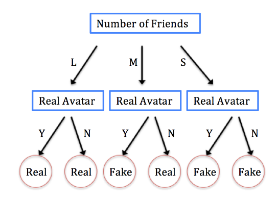
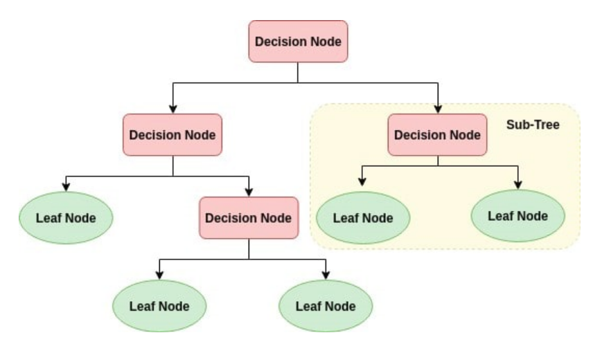
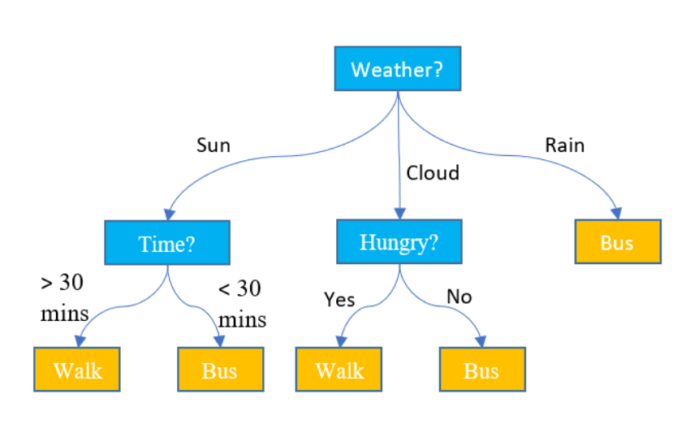

We discuss tree based methods here.(Now here include ensemble methods)

# Decision Tree

## What is decision tree?

**(说白了就是每层来细分你的features)**

- Decision Tree is a supervised prediction model.
- Decision Tree is a usually a k-nary tree. Each leaf denotes one classification or continuous value of the dependent variable.
- Two types of Decision Tree: Classification/Regression Tree

root node&splitting&decision node&leaf/terminal node&Pruning&Branch/Sub-tree&Parent and Child Node

参考：

1）decision tree 是属于decision tree learning这一块的，如果是二分的问题，就是基于每个feature进行分类，在树结构上进行classification和regression（divide and conquer strategy）

2）tree结构：In keeping with the tree analogy, the regions $R_1$, $R_2$ and $R_3$ are known
as terminal nodes or leaves of the tree.

3)Tree based methods partition the feature space into a set of rectangles, and then fit a simple(like a constant) in each one.

## How to Build a Decision Tree?

**two steps:**

1. **Feature prioritization（一层在哪）**
2. **Feature splitting（每一层分几个）**

相当于你每层都在对一个features进行切割（你想象成为scenario tree）

### How to build(ID3 Algorithm)?

- At each iteration step, we split the feature which can give us the largest entropy gain

- definition of entropy熵：
  $$
  I_e(i)=-log_2 p_i
  $$
  Entropy of the entire information system:
  $$
  H= \sum_{i=1}^n p_i I_e(i)= - \sum_{i=1}^n p_i \log_2 p_i
  $$
  example:

​	**Entropy of the current system**:(注意第一步算的是dependent variable的熵）
$$
H_Y= \sum_{i=1}^n p_i I_e(i)= - \sum_{i=1}^n p_i \log_2 p_i=Y的熵+N的熵= -0.7\log_2 0.7 +-0.3 \log_2 0.3=0/879
$$
​	**Condition entropy:** （现在在之前那个entropy下，看看变化）

这里考虑blog（C）在之前Y下状态下的 conditional entropy
$$
H_{Y\vert C}= P(C=L) H(Y \vert C=L)+P(C=M) H(Y \vert C=m)+P(C=S) H(Y \vert C=S)
$$
where $P(C=L)= 0.3 , P(C=M) = 0.4, P(C=S) =0.3$

$H(Y\vert C=L)=3/3, H(N\vert C=L)=0$;

$H(Y\vert C=M)=3/4, H(N\vert C=M)=1/4$; 

$H(Y\vert C=S)=1/3, H(N\vert C=S)=2/3$

​	**Information gain = Entropy - Conditional Entropy**

The entropy gain(增益，就是变化) by splitting feature C =0.879-0.603=0.276

The entropy gain(增益，就是变化) by splitting feature A =0.033

The entropy gain(增益，就是变化) by splitting feature B =0.553

Therefore ,we choose Feature B as the first splitting feature(相当于用熵来feature selection，先选影响大的)

### How to build(geometric)?

如何分割，其实相当于你在平面上来分割，可以当作是GAM model

**Prediction via Stratification of the Feature Space**(相当于你在特征空间分层预测,基本上和linear的不一样的地方，linear是线，这里是竖的还有横的)

1. We divide the predictor space—that is, the set of possible values for
   $X_1,X_2,\cdots, X_p$—into $J$ distinct and non-overlapping regions $R_1, R_2, \cdots, R_J$.
2. For every observation that falls into the region $R_j$ , we make the same
   prediction, which is simply the mean of the response values for the
   training observations in $R_j$ .

For step 1, **how do we construct the regions**  $R_1, R_2, \cdots, R_J$?

1. **a top-down, greedy approach** 自上而下"说的是从树顶分割成两个新的分支 The approach is top-down because it begins at the top of the tree (at which point
   all observations belong to a single region) and then successively **splits the predictor space**(依次分裂预测变量空间); each split is indicated via two new branches further down
   on the tree.
2. that is known as ***recursive binary splitting***
3. **greedy:** It is greedy because at each step of the tree-building process,在建立树的每一个步骤中
4. **best：**he best split is made at that particular step, rather than looking ahead
   and picking a split that will lead to a better tree in some future step.分裂确定的仅限于某一部进程，而不是针对区选择能够在未来进程中构建出更好的树的分裂点t
5. 寻找继续分割数据及的最优预测变量&最优分割点

## 

## Compare with GAM&linear regression

- $E[Y\vert X_1,\cdots,X_p]=\alpha+f_1(X_1)+\cdots+f_p(X_p)-$  Generalized additive model(GAM)
- 不是线性，是因为不是多项式

- We can formulate decision tree model as the following formula：

$$
f(X)= \sum_{k=1}^K contribution(x_k)= =\sum_{k=1}^K c_k I_{(X \in R_k)}
$$

这里的$contribution(x_k)$表示的是输入数据第$k$个feature 对输出结果产生的作用，它可能是信息熵/gini impurity（见下一小节）的减少。

- 如果和linear regression 比较

$$
f(X)=\beta_0+\sum_{j=1}^KX_j\beta_j
$$

在LR里面中， $x_k$这项对$f(X)$的contribution是确定的，只与自己的取值和对应的系数有关

- Decision tree中的$contribution(x_k)$的取值，不仅仅与$x_k$有关，也与$X$中其他feature所决定的整个decision path有关（可以看到前面例子real avatar，不止对前面和后面两个feature都有影响）（更具体地说，feature在path上的先后顺序不同，它的contribution就会不同）
- 很明显，这是一个非线性关系

Decision Tree的特点

- 优点：他可以用来描述x和y之间更复杂的关系，建模能力更强（有人用来直接feature selection）
- 缺点：严重overfitting

## How to know decide which feature first?

6）**如何判定好坏**，比较前后的misclass的比例；用三个不同的entropy&gini

​	tree regression: RSS $\sum_{j=1}^J\sum_{i \in R_i}(y_i-\hat{y}_{R_i})^2$  ,where $R_{i \in J}$ is the amount of region

​	tree classification: 

- Classification error rate $E=1-\max_{k}(\hat{p}_{mk})$
- Gini Index: $G=\sum_{k=1}^K\hat{p}_{mk}(1-\hat{p}_{mk})$
- cross-entropy: $D=-\sum_{k=1}^K\hat{p}_{mk}\log {\hat{p}}_{mk} $

## Tree Pruning

- 解决overfitting，不能用Regularization（因为你没loss function呀）
- post-pruning/pre-pruning

- The process described above may produce good predictions on the training set, but is likely to overfit the data, leading to poor test set performance.

- **How do we determine the best way to prune the tree? **
  Intuitively, our goal is to select a subtree that leads to the lowest test error rate.
  Use $K$-fold cross-validation to choose $\alpha$. That is, divide the training observations into $K$ folds. For each $k = 1, \cdots, K$:

# Tree Model with ensemble method

## 简介：

- In ensemble learning, we train multiple learners to solve the same problem.
- 这些方法的出现，原本是为了来帮助decision tree，让一个本来variance很高，但bias比较低的进行一些转变.由于decision tree 的variance会比较大，bias小，所以可以用ensemble的方法

- Ensemble learning including boosting method(Adaboosting) and bagging method(random forest).

**Bagging --> focus on reducing variance**(bootstrap，用已有的sample，多次重复，当然是降低variance)

- **learning independently from each other in parallel**
- **combine with deterministic averaging process**
- bagging里有random forest

**Boosting --> focus on reducing bias**(每次增加sample，然后调整权重，调整背后的distribution，当然是降低bias)

- **Learn sequentially in a adaptative way(a base model depends on the previous ones)**
- **Combine with deterministic strategy**
- boosting里面有adaboosting&GBDT&XGboosting)
- boost主要是increasing your mistakes weight（Adaboost）

## bagging的原理：

### what is bagging（回答面试？）：（有放回抽样）

- bagging == bootstrapping
- bagging is an ensemble learning method
- bagging method -sampling with replacement
- advantage: decrease variance by introducing randomness into your model framework
- random forest leverages a a bagging method to solve overfitting problems in complete decision trees. 

 1. 就是bootstrap， 相当于你对现有的sample 再次sample，也就是resample，记得我们学高级统计时候，证明过，这样可以降低variance，同时其预测的插值还符合正态分布

 2. 采用的方式就是 $\hat{f}_{avg}=\frac{1}{B}\sum_{b=1}^B {\hat{f}_b}(x)$ 来降低variance，但实际情况不可能所以，In this approach we generate $B$ different bootstrapped training data sets. We then train our method on the $b$-th bootstrapped training set in order to get $\hat{f}^{\ast b}(x)$, and finally average all the predictions, to obtain

    ​	 
    $$
    \hat{f}_{bag}(x)=\frac{1}{B}\sum_{b=1}^B \hat{f}^{\ast b}(x)
    $$

### 主要算法**random forest**:

假设总体数据中有N个样本，每个样本有m个特征属性（feature）

- 每次从原数据中有方回地**随机选取N个观测值**（注意这个过程中有的样本可能被选了多次有的样本可能被没有包含在取出的N个观测值中）
- 从得到的这些样本中**随机选取k（k<m）个特征**，利用这k个特征计算出一个最佳分裂方式的decision tree
- 多次重复上面的操作，得到一组互不相同的decision tree，把他们整合起来构成random forest 模型，对新数据进行分类或者预测

1. Random forests provide an improvement over bagged trees by way of a small tweak that decorrelates the trees.a random sample of
   *$m$ predictors is chosen as split candidates from the full set of p predictors.*
   *The split is allowed to use only one of those m predictors.*

2. A fresh sample of $m$ predictors is taken at each split, and typically we choose $m \approx \sqrt{p} $—thatis , the number of predictors considered at each split is approximately equal to the square root of the total number of predictors
3. **The main difference** between bagging and random forests is the choice
   of predictor subset size $m$.
4. We can think of this process as **decorrelating** the trees, thereby making the average of the resulting trees less variable and hence more reliable.
5. averaging many highly correlated quantities does not lead to as large of a reduction in variance as averaging many uncorrelated quantities.
   **感想：说白了就是你用了少的sample自然reduce variance? 相当于RF就是控制m 你重复的此书**
6. out of bag estimate?

### summary of random forest(面试)

- **sample idea in a random forest algorithm:**
  - **bagging for data**
  - **sampling for features**(不改变features的distribution)
- In the random forest algorithm, we do NOT need to do pruning for each 'weak' decision tree.
- Advantage of random forest
  - **less overfitting**(你random后那些不重要的更不重要了，其实也是CLT)
  - **parallel implementation**
- random forest VS Bagging: **difference at the feature sampling step.**(random forest feature也抽样了)

(这里的majority decision可以average，当然这里的树不需要合在一起)

### Feature Importance value in random forest

$$
importance(i)= performance(RF)- performance(RF^{\ random \ i})
$$

- It does not signify positive or negative impact on the class label. It only judges how much class discriminatory information each variable contains.

(RF非常擅长抓住nonlinear之间的关系，nonlinear很痛苦的地方就是不提供interpretability，那我该怎么办呢？相当于找coeffiecent/ MSE）

（相当于引入一个随机量，让这个feature就没了，但是又好过去掉feature，但是就随机（比如随机$X_4$把$X_4$random）,当你随机后，你的random forest就改变了，很自然你就知道这个feature的important，这又像feature selection）

- decision tree可不可以做feature importance?不能（因为没有feature sampling）

- performance 可以是confusion matrix /F1

notes:

1. 如果是feature有categorical和continuous，你可能先做categorical（当然可以从数据本身来）

## Boosting：

1. bagging involves creating multiple copies of the original training data set using the bootstrap, fitting a separate decision tree to each copy, and then combining all of the trees in order to create a single predictive model.(bagging是用再抽样法创造多个副本，在对每个副本建立决策树，然后将这些数结合在一起来建立一个预测模型)

2. 每一棵树都是建立在一次bootstrap上，与其他树独立；boosting也是类似，但是这里的树采用**sequentially** 顺序生成：

   - each tree is grown using information from previously grown trees. 
   - Boosting does not involve bootstrap sampling; instead each tree is fit on a modified version of the original data set.

   感想1:相当于改变本身的树，而不是sample 树本身&这是弱学习转化成为强学习;

   感想2：给定一份训练数据集（各样本权重是一样的，之后会有变化），然后进行M次迭代，每次迭代后，**对分类错误的样本加大权重,对正确分类的样本减少权重**，在下一次的迭代中更加关注错分的样本。

3. Boosting has three tuning parameters:

   - The number of trees B:Unlike bagging and random forests, boosting can overfit if B is too large, although this overfitting tends to occur slowly if at all. We use cross-validation to select $B$.
   - The shrinkage parameter $\lambda$: Typical values are $0.01$ or $0.001$, and the right choice can depend on the problem. Very small $\lambda$ can require using a very large value of B in order to achieve good performance.
   - The number $d$ of splits in each tree, which controls the complexity of the boosted ensemble. Often $d = 1$ works well, in which case each tree is a stump

#### 		主要算法 adaboosting&XGBoost&Gradient Boosting

Boosting 提升法.一种将多个弱分类器通过组合提升为强分类器的思想.
它实现的关键在于：在每轮迭代训练中，通过改变样本权重的方式改变样本分布，从而在下一轮对误分或者偏差大的样本进行近似局部的拟合(类似于加权回归中的加权,这更容易理解)，最后组合起来，达到提升的目的.
这里会有几个问题：

1. 每轮训练偏差大小的标准是什么？(与损失函数有关)
2. 弱分类器怎么组合？(损失函数 对 模型权重 求偏导)
3. 样本权重怎样调整？

# Supplement-Decision Tree

所以决策树算法的核心是要解决两个问题：

**1）如何从数据集中找出最佳分枝？**

**2）如何在合适的时候让决策树停止生长，防止过拟合？**

几乎所有与决策树有关的模型调整方法，都逃不开这两个核心问题。

**关于第一个问题，一个数据集必然给出了很多的特征，先按照哪个特征来高效地划分数据集，**是决策树需要解决的最大问题。当然，我们完全可以按照特征从头到尾顺次来划分数据集，但是，这样做其实并不好，因为你如果一不小心把重要的特征排到了后边，那么你的决策树会很低效。

于是，机器学习专家们就去信息学科中偷来了一个词语：信息熵。信息越确定（单一），信息熵越小；信息越多变（混乱），信息熵越大。

通过比较拆分前后的信息熵之差找出更重要的特征的方法，就产生了ID3和C4.5两种决策树算法。

之后，科学家又找到了一个更好的衡量方法——基尼系数。于是就产生了CART决策树。

#### **Reference**:

1. 机器学习西瓜书

2. an introduction to statistical learning

https://zhuanlan.zhihu.com/p/57324157

3. Andrew Ng: https://www.youtube.com/watch?v=wr9gUr-eWdA&list=PLoROMvodv4rMiGQp3WXShtMGgzqpfVfbU&index=10

4. https://liangyaorong.github.io/blog/2017/%E6%B7%B1%E5%85%A5%E7%90%86%E8%A7%A3Boosting/

   https://www.zybuluo.com/frank-shaw/note/127048

5. 很好的调参模型

   https://zhuanlan.zhihu.com/p/103136609

6. 解释tree层的问题https://blog.csdn.net/u012328159/article/details/70184415

# 集成学习（Ensemble Method）

## 集成方法：

基本上常和树模型一起 link tree models

decision tree——1）boosting&Adaboosting（代表）；2）bagging&random forest（bagging的变形）

1）==boosting==：每次增加sample，然后调整权重，调整背后的distribution，当然是降低bias

​	boosting里面有adaboosting&GBDT&XGboosting

2）==bagging==：其实就是bootstrap，用已有的sample，多次重复，当然是降低variance

​	random forest：随机属性？？？？

综合方法：meta algorithm&stacking algorithm

further steps:上课所记载的关于decision tree的（andrew NG的 youtube 课）